# hexagonal_histograms

The package is used to generate geometry root files for the HGCAL DQM wafer maps.

| ML-F | ML-L | ML-R |
| --- | --- | --- |
| 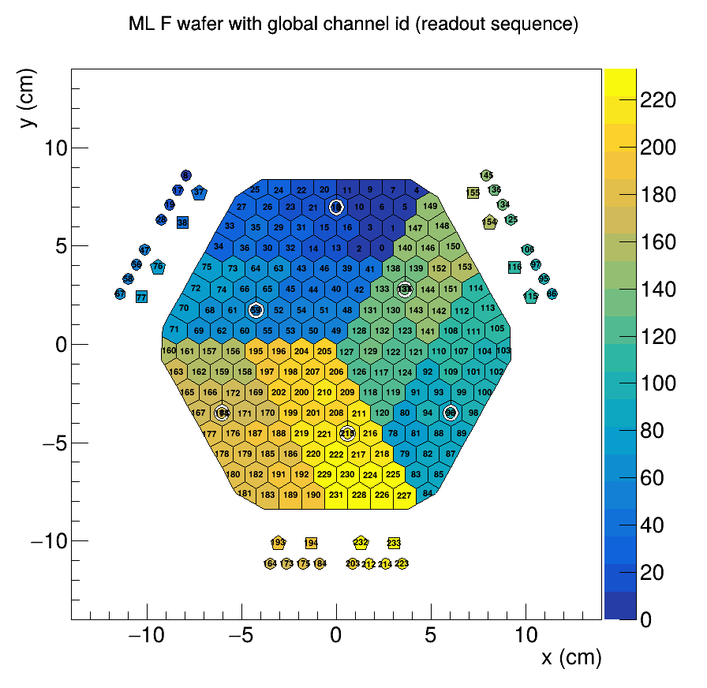 |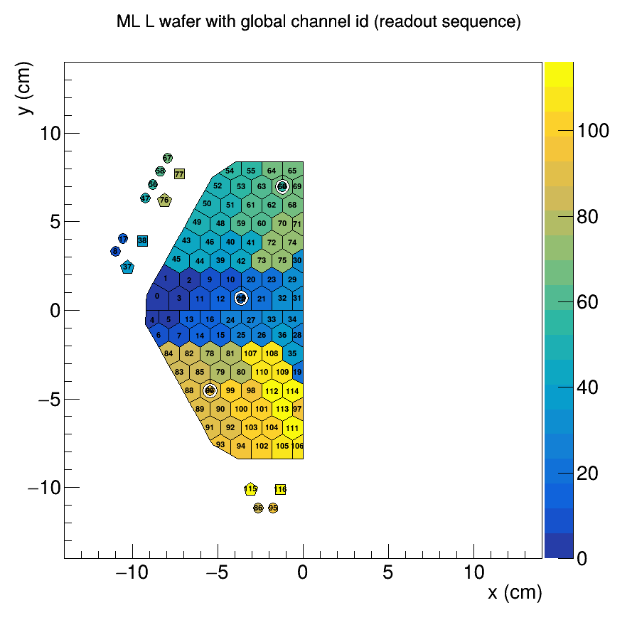 | 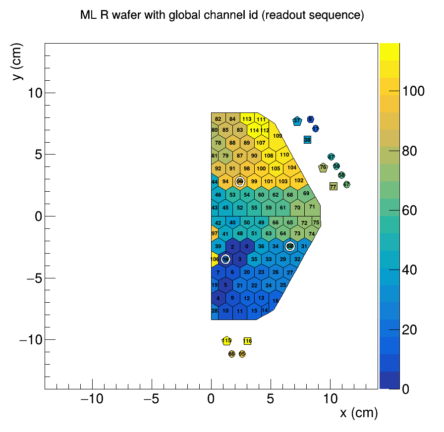 |
| ML-5 | ML-T | ML-B |
|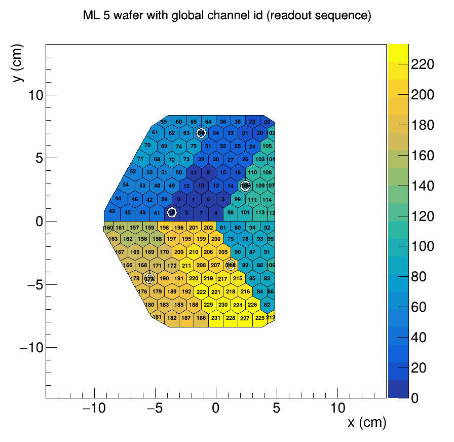 |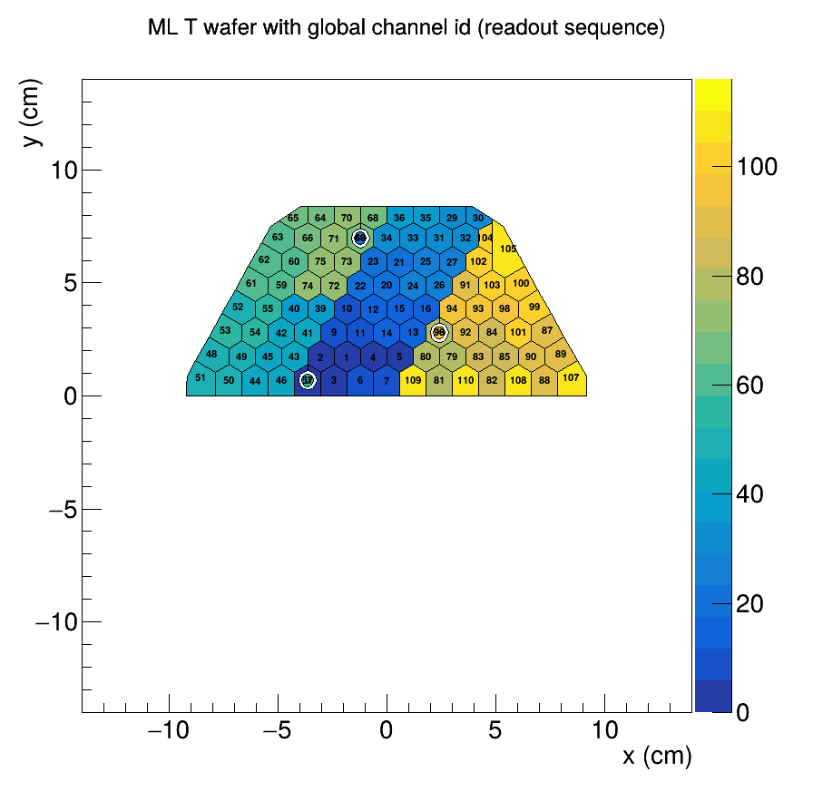 |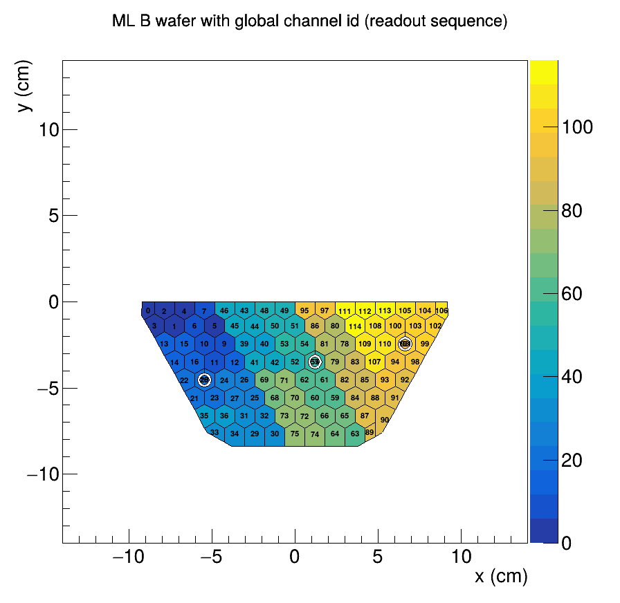 |
| MH-F | MH-L | MH-R |
| 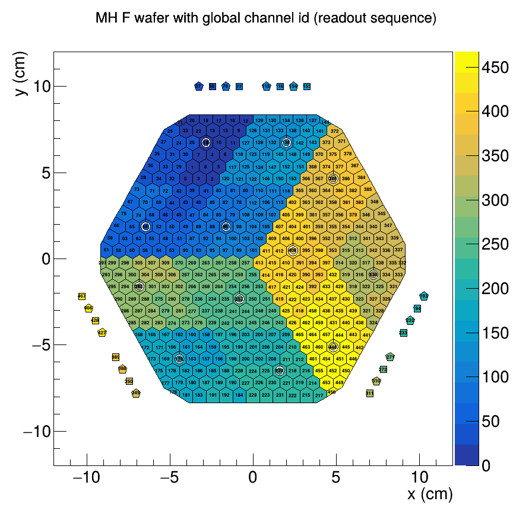 | 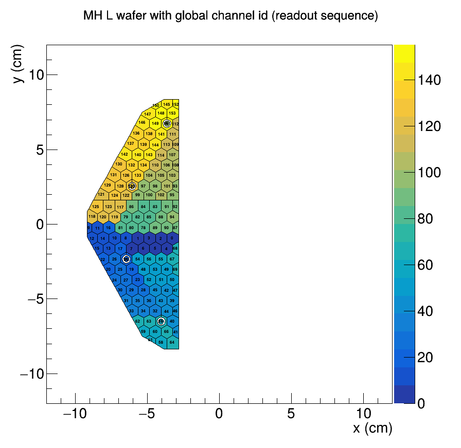 | 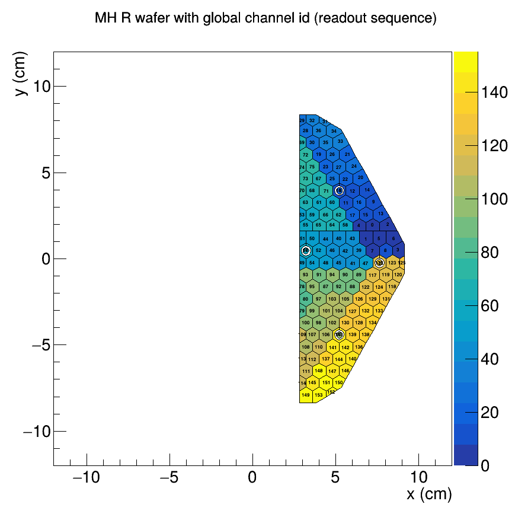 |
| MH-T | MH-B | |
| 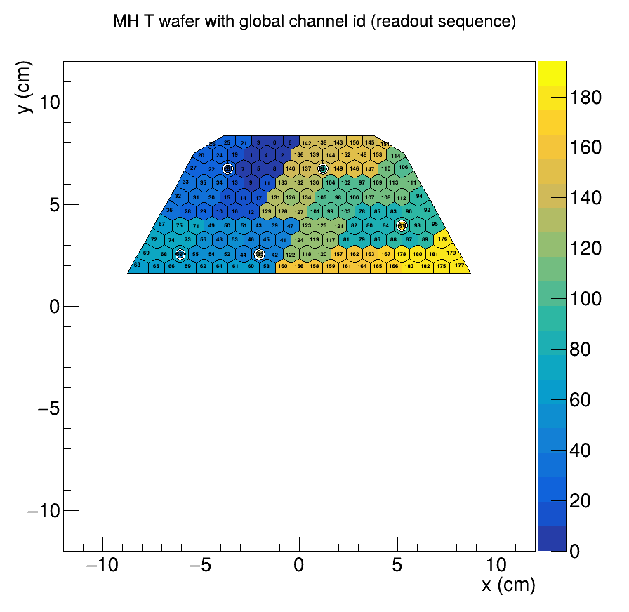 | 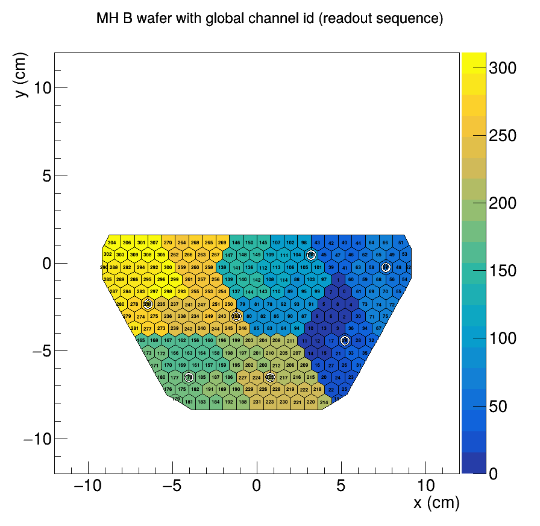 | |

We use PyROOT to create a collection of polygons/cells/silicon pads as TGraph objects in geometry root file.
For each cell, the center position (x, y) is derived using HGCAL DPG tool, `src/HGCalCell.cc`.
The C++ class is used in Python script through `ROOT.gInterpreter` in `utils/polygon_manager.py`, as shown the following lines:

```
ROOT.gInterpreter.ProcessLine('#include "include/HGCalCell.h"')
ROOT.gSystem.Load("./build/libHGCalCell.so")
cell_helper = ROOT.HGCalCell(waferSize, nFine, nCoarse)
```

Therefore, to run the package, we need to ensure that the Python version is compatible with the one used to build ROOT.
To avoid building ROOT from scratch and potential compatible issues, we recommend using the pre-built CVMFS ROOT from LCG releases.

## Environment

On lxplus, set up the environment as follows:

1. Load ROOT
Run the following command to source the ROOT environment:
```
source /cvmfs/sft.cern.ch/lcg/app/releases/ROOT/6.34.04/x86_64-almalinux9.5-gcc115-opt/bin/thisroot.sh
```

2. Set up Python environment (first time only)
Create a virtual environment for Python dependencies:
```
python3 -m venv pandas_env
source pandas_env/bin/activate
pip install pandas
pip install pyyaml
```

3. Routine session (after first setup)
For regular use, activate the environments as follows:
```
source /cvmfs/sft.cern.ch/lcg/app/releases/ROOT/6.34.04/x86_64-almalinux9.5-gcc115-opt/bin/thisroot.sh
source pandas_env/bin/activate
```

To deactivate the virtual environment when finished:
```
deactivate # deactivate the environment when finished
```

## Setup
Clone the repository and build the project:
```
$ git clone -b dev git@github.com:ywkao/hexagonal_histograms.git
$ cd hexagonal_histograms
$ make
```

## Usage
List available wafer types
```
$ ./exe.py --list-types # List all available wafer types
```

Generate outputs for specific wafer types (with verbose logging)
```
$ ./exe.py -t ML-F -v
$ ./exe.py -t MH-F -v
$ ./exe.py -t ML-T -v
$ ./exe.py -t ML-B -v
$ ./exe.py -t ML-L -v
$ ./exe.py -t ML-R -v
$ ./exe.py -t ML-5 -v
$ ./exe.py -t MH-T -v
$ ./exe.py -t MH-B -v
$ ./exe.py -t MH-L -v
$ ./exe.py -t MH-R -v
```

Output directories
- `output/geometry/`: Root geometry files
- `output/waferMaps/`: Wafer map visualizations
- `output/coordinates/`: JSON files with cell coordinates
- `output/mapping/`: JSON files with cell ID mappings

Verbose option `-v` includes:
- cell name (e.g., `hex`, `hex_nc`, `hex_cm`)
- cell IDs (Global ID / ROC Pin / SiCell)
- cell area in mm^2


Produce {global_channel_id: sicell/rocpin} maps
```
$ python3 utils/channel_id_mapper.py

# Expected output:
#   ./scripts/include/map_channel_numbers.h
#   ./output/mapping_csv/{wafer_type}_globalId_vs_sicell.csv
```

Demonstration of how to `TH2Poly` with a geometry ROOT file
```
$ root -l -b -q scripts/tutorial_th2poly.C

# Expected output:
#   ./output/waferMaps/tutorial.png
```

## Description of main scripts
| File                         | Description                                                           |
| ---------------------------- | --------------------------------------------------------------------- |
| `exe.py`                     | Top-level script steering workflow with the following options:<br> -w, --waferType [full\|LD3\|LD4\|HD] # set wafer type<br> -d, --drawLine # draw boundary lines<br> -v, --verbose # set verbosity level |
| `utils/polygon_manager.py`   | Methods for generating polygonal bins & producing geometry root files |
| `utils/geometry.py`          | Parameters of polygons                                                |
| `th2poly.C`                  | Macro drawing wafer maps from a geometry root file                    |

## Workflow in the code
- Build a c++ shared library which contains a function to convert HGCAL (u, v) to (x, y)
- Import c++ class using PyRoot gInterpreter and gSystem
- Load cell information from `data/input/WaferCellMapTrg.txt`
- Generate polygonal bins in TGraph
- Produce a geometry root file with a collection of graphs
- Make a hexagonal histogram using TH2Poly in a ROOT macro

## Steps for DQM GUI display (not in this repository)
- Main idea: txt file -> TGraphs -> TH2Poly -> DQM GUI Display
- Require TH2Poly implemented in DQM EDAnalyzer
- Load the geometry root file in DQM EDAnalyzer
- Fill entries & produce plots

## Reference
- https://root.cern/manual/python/
- https://root.cern/doc/master/th2polyEurope_8C.html
- https://github.com/cms-sw/cmssw/blob/master/Geometry/HGCalCommonData/src/HGCalCell.cc
